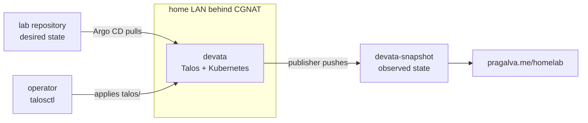

# devata


<sub>These numbers are published by the cluster itself: a read-only CronJob in devata renders an allowlisted snapshot every hour and pushes it to [devata-snapshot](https://github.com/PragalvaXFREZ/devata-snapshot), and the badges read that file. The publisher lives in [`kubernetes/apps/showcase/snapshot-publisher/`](./kubernetes/apps/showcase/snapshot-publisher). The colors are deliberately neutral rather than green: a badge shows the last published value, and the `last snapshot` timestamp is the freshness check. The same file drives the live page at [pragalva.me/homelab](https://pragalva.me/homelab).</sub>

This repository defines **devata**, a [Talos Linux](https://www.talos.dev/) Kubernetes cluster managed with Argo CD. It is the declarative source of truth for the cluster and a reviewable record of its architecture, trust boundaries, and operating model.

Talos machine configuration inputs are version controlled here and applied out of band with `talosctl`. Kubernetes platform components and workloads are reconciled from Git. Experiments remain outside the reconciled paths so they can fail without becoming desired state.

## Architecture

The cluster sits on a home LAN behind CGNAT. Desired state comes in through Argo CD's outbound pull, while the public snapshot leaves through a publisher with read-only cluster access and write access to a separate data repository.



The repository separates three operational planes and an unreconciled sandbox:

1. **OS and machine** lives in [`talos/`](./talos). Node configuration, reusable patches, and Image Factory schematics. Version controlled for history and review, applied with `talosctl`. This is the GitOps boundary: the reconciler manages Kubernetes objects, not the operating system.

2. **Platform** lives in [`kubernetes/infra/`](./kubernetes/infra). The components that make the cluster usable: networking, controllers, observability, ingress, and storage.

3. **Workloads** live in [`kubernetes/apps/`](./kubernetes/apps). The things that run on top of the platform.

The **sandbox** in [`lab-experiments/`](./lab-experiments) is where things get broken on purpose. Argo CD never points at it, which makes it safe to experiment without fighting the reconciler.

## Trust boundaries

- **`talos/` is reviewed but not reconciled.** It contains reusable patches, non-secret volume documents, and Image Factory schematics. Rendered machine configurations contain cluster trust material and remain outside Git.
- **`kubernetes/` contains authoritative cluster state.** Bootstrap is applied once by hand; the root and child Applications reconcile cluster composition, platform components, and workloads with self-heal enabled. Pruning is enabled except where a component's recovery boundary requires otherwise, such as Argo CD managing its own installation.
- **`lab-experiments/` is non-authoritative.** Nothing in the sandbox is referenced by the GitOps root or child Applications.
- **Public state is allowlisted.** The snapshot publisher reads through a dedicated read-only ServiceAccount, builds a new document from approved fields, validates it against a closed schema, and can write only to `devata-snapshot`.

## Repository map

```
lab/
├── README.md                  # this file: what devata is, the architecture, the map
├── docs/
│   ├── conventions.md         # the hygiene rules this repo lives by
│   └── decisions/             # architecture decision records (why, not just what)
│
├── talos/                     # OS and machine layer, applied by talosctl, NOT reconciled by GitOps
│   ├── machineconfigs/        # per node configuration
│   ├── patches/               # reusable config patches
│   └── schematics/            # Image Factory schematics (system extensions, kernel args)
│
├── kubernetes/                # authoritative cluster state, the ONLY path the GitOps controller watches
│   ├── bootstrap/             # the GitOps controller install and the single root app applied once by hand
│   ├── clusters/
│   │   └── devata/            # the app of apps and ApplicationSets for this cluster
│   ├── infra/                 # the platform layer
│   │   ├── networking/        # cluster networking and service load balancing
│   │   ├── controllers/       # cluster-wide operators
│   │   ├── observability/     # metrics, logs, and dashboards
│   │   ├── ingress/           # public exposure components
│   │   └── storage/           # storage classes and persistence configuration
│   └── apps/                  # workloads
│       └── showcase/          # public evidence produced by the cluster
│
├── ansible/                   # host bootstrap and automation
├── scripts/                   # deterministic repository checks
│
├── lab-experiments/           # the sandbox, the reconciler NEVER points here, safe to break
│   └── kubernetes/            # practice manifests and one off experiments
│
├── archive/                   # historical learning material
└── blogs/                     # links to published write ups
```

## Bootstrap and validation

The manifests are specific to devata rather than a generic cluster template. After the Talos cluster exists, the [`kubernetes/bootstrap/` runbook](./kubernetes/bootstrap) installs Argo CD and applies the single root Application that transfers ownership to GitOps.

Pull requests validate Kubernetes manifests with strict `kubeconform`, render every chart-backed Argo CD Application with its repository values, and check active Markdown files and the root README contract. The exact checks live in [`.github/workflows/`](./.github/workflows).

Run the deterministic documentation check locally with:

```sh
python3 scripts/check-docs.py
```

## Engineering records

- Repository rules and documentation ownership: [`docs/conventions.md`](./docs/conventions.md)
- Architecture decisions and their consequences: [`docs/decisions/`](./docs/decisions)
- Reproducible experiments and failure evidence: [`lab-experiments/`](./lab-experiments)
- Live public cluster view: [pragalva.me/homelab](https://pragalva.me/homelab)
- Generated public data: [PragalvaXFREZ/devata-snapshot](https://github.com/PragalvaXFREZ/devata-snapshot)
- Work queue and acceptance criteria: [GitHub issues](https://github.com/PragalvaXFREZ/lab/issues)
- Published write ups: [`blogs/`](./blogs)

The reasoning behind the repository structure is recorded as [ADR 0001](./docs/decisions/0001-repository-structure.md).
