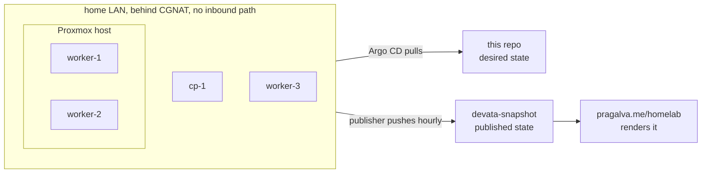

# devata


<sub>These numbers are published by the cluster itself: a read-only CronJob in devata renders an allowlisted snapshot every hour and pushes it to [devata-snapshot](https://github.com/PragalvaXFREZ/devata-snapshot), and the badges read that file. The publisher lives in [`kubernetes/apps/showcase/snapshot-publisher/`](./kubernetes/apps/showcase/snapshot-publisher). The colors are deliberately neutral rather than green: a badge shows the last published value, and the `last snapshot` timestamp is the freshness check. The same file drives the live page at [pragalva.me/homelab](https://pragalva.me/homelab).</sub>

This repository is the declarative source of truth for **devata**, my home Kubernetes cluster, and the public log of how it is built. The aim is a portfolio grade repo where the whole cluster is defined as code, the learning sandbox stays clearly separated from authoritative state, and every workstream planned over the coming months already has an obvious place to land.

devata runs [Talos Linux](https://www.talos.dev/) and is reconciled with GitOps. The operating system is version controlled here but applied out of band with `talosctl`; everything from the platform up is Kubernetes state that a GitOps controller reconciles from this repository.

## Hardware

Salvaged machines, on purpose. The point of this cluster is the platform on top, not the metal underneath.

| Node | Role | Machine | CPU | Memory (allocatable) |
| --- | --- | --- | --- | --- |
| cp-1 | control plane | HP ProBook laptop | 4 vCPU | 3.3 GiB |
| worker-1 | worker | QEMU VM on a Proxmox host | 2 vCPU | 2.9 GiB |
| worker-2 | worker | QEMU VM on a Proxmox host | 2 vCPU | 2.9 GiB |
| worker-3 | worker | Acer Nitro 5 AN515-44 laptop | 16 vCPU | 7.1 GiB |

The Nitro 5 carries a GeForce GTX 1650 Ti that is faulted at the hardware level: across two independent driver branches, with GSP firmware on and off, the driver fails `RmInitAdapter` and cannot read the card's VBIOS, while every layer above it (Talos extensions, kernel modules, RuntimeClass, device plugin, container toolkit) was proven working. The full enablement work and its verdict are preserved in [`lab-experiments/kubernetes/gpu-enable/`](./lab-experiments/kubernetes/gpu-enable). The AI serving path targets the 16 vCPU worker on CPU instead ([#11](https://github.com/PragalvaXFREZ/lab/issues/11)).

## Network

The cluster sits on a home LAN behind CGNAT, so no connection can reach it from outside. Everything public about this cluster leaves through an outbound connection the cluster itself initiates: Argo CD pulls desired state from this repo, and the snapshot publisher pushes observed state out.



Inside the LAN, Cilium is the CNI (eBPF dataplane, kube-proxy replacement, Hubble observability) and MetalLB answers for LoadBalancer services. Grafana, Hubble UI and Argo CD stay LAN-only today. A Cloudflare Tunnel ([#13](https://github.com/PragalvaXFREZ/lab/issues/13)) is the planned outbound-only door for anything that should ever face the internet.

## Architecture

The repository is organised as three planes, kept separate on purpose, plus a sandbox that sits outside all of them.

1. **OS and machine** lives in [`talos/`](./talos). Node configuration, reusable patches, and Image Factory schematics. Version controlled for history and review, applied with `talosctl`. This is the GitOps boundary: the reconciler manages Kubernetes objects, not the operating system.

2. **Platform** lives in [`kubernetes/infra/`](./kubernetes/infra). The components that make the cluster usable: networking, controllers, observability, ingress, and storage.

3. **Workloads** live in [`kubernetes/apps/`](./kubernetes/apps). The things that run on top of the platform.

The **sandbox** in [`lab-experiments/`](./lab-experiments) is where things get broken on purpose. The GitOps controller never points at it, which is what makes it safe to experiment in without fighting the reconciler.

The single most important rule that follows from this: **the GitOps controller watches only `kubernetes/`.** Everything under that path is authoritative and is reconciled back to git if it drifts. Nothing else is.

## Repository map

```
lab/
├── README.md                  # this file: what devata is, the architecture, the map
├── docs/
│   ├── conventions.md         # the hygiene rules this repo lives by
│   └── decisions/             # architecture decision records (why, not just what)
│
├── talos/                     # OS and machine layer, applied by talosctl, NOT reconciled by GitOps
│   ├── machineconfigs/        # per node configuration
│   ├── patches/               # reusable config patches
│   └── schematics/            # Image Factory schematics (system extensions, kernel args)
│
├── kubernetes/                # authoritative cluster state, the ONLY path the GitOps controller watches
│   ├── bootstrap/             # the GitOps controller install and the single root app applied once by hand
│   ├── clusters/
│   │   └── devata/            # the app of apps and ApplicationSets for this cluster
│   ├── infra/                 # the platform layer
│   │   ├── networking/        # cilium, metallb, gateway and routes
│   │   ├── controllers/       # cert-manager, sealed-secrets, and similar operators
│   │   ├── observability/     # prometheus stack, loki, promtail, dashboards
│   │   ├── ingress/           # gateways and the cloudflared tunnel
│   │   └── storage/           # storage classes today, longhorn and velero later
│   └── apps/                  # workloads
│       └── showcase/          # the snapshot publisher, and future apps beside it
│
├── ansible/                   # host bootstrap and automation
│
├── lab-experiments/           # the sandbox, the reconciler NEVER points here, safe to break
│   └── kubernetes/            # practice manifests and one off experiments
│
├── archive/                   # finished learning material, kept for the record
└── blogs/                     # published write ups
```

## Conventions

This repo is run declaratively, and the rules that keep it that way are written down in [`docs/conventions.md`](./docs/conventions.md) so they outlive any single session. The short version: declarative only, secrets are encrypted before they are committed, the OS layer is applied separately, and one concern lives in one directory and graduates rather than being copied.

The reasoning behind the structure itself is recorded as [ADR 0001](./docs/decisions/0001-repository-structure.md).

## Status

The skeleton was the beginning; most of what it reserved space for has landed.

- **GitOps backbone, live.** Argo CD reconciles the whole cluster from this repo as an app of apps, and `helm list -A` on devata returns nothing: zero imperative Helm state ([#9](https://github.com/PragalvaXFREZ/lab/issues/9)).
- **Secrets, live.** Sealed Secrets; every secret is encrypted before it is committed ([#8](https://github.com/PragalvaXFREZ/lab/issues/8)).
- **Snapshot publisher, live.** An hourly in-cluster CronJob publishes the snapshot the badges above read, and doubles as an off-cluster uptime ledger, one commit per beat ([#12](https://github.com/PragalvaXFREZ/lab/issues/12)).
- **Next:** storage durability, since Prometheus data currently does not survive node reboots under the local-path setup ([#14](https://github.com/PragalvaXFREZ/lab/issues/14)); Gateway API with cert-manager for real ingress and TLS ([#10](https://github.com/PragalvaXFREZ/lab/issues/10)); the Cloudflare Tunnel ([#13](https://github.com/PragalvaXFREZ/lab/issues/13)); llama.cpp serving a small quantized model on the 16 vCPU worker, GitOps managed ([#11](https://github.com/PragalvaXFREZ/lab/issues/11)).
